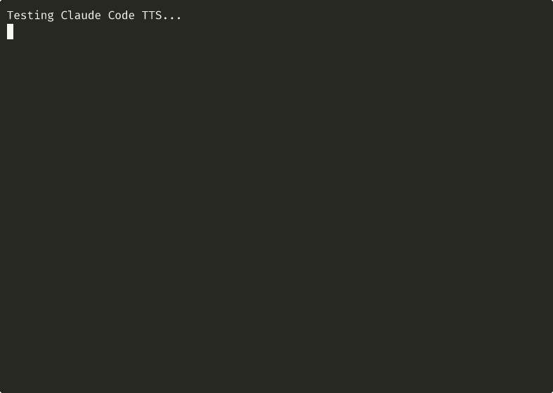

# Claude Code TTS Plugin

[](https://golang.org)
[](LICENSE)
[](https://github.com/ybouhjira/claude-code-tts/actions/workflows/ci.yml)
[](https://codecov.io/gh/ybouhjira/claude-code-tts)
[](https://modelcontextprotocol.io)

A Text-to-Speech MCP server plugin for Claude Code that converts text to speech using OpenAI's TTS API or ElevenLabs. Get audio feedback from Claude as you work!



## Features

- **Deterministic Auto-Speak**: Every Claude response is automatically spoken (via Stop hook)
- **Two TTS Providers**: OpenAI (alloy, echo, fable, onyx, nova, shimmer) and ElevenLabs (any voice on your account, discovered automatically, plus raw voice IDs), selectable per request
- **Worker Pool Architecture**: Non-blocking queue with concurrent processing
- **Mutex-Protected Playback**: One audio plays at a time, no overlapping
- **Cross-Platform**: macOS (afplay), Linux (mpv/ffplay/mpg123), Windows (PowerShell)
- **Standalone CLI**: `speak-text` binary for direct TTS without MCP

## Quick Install

```bash
# One-liner installation
curl -fsSL https://raw.githubusercontent.com/ybouhjira/claude-code-tts/main/install.sh | bash
```

Or install manually:

```bash
git clone https://github.com/ybouhjira/claude-code-tts.git ~/.claude/plugins/claude-code-tts
cd ~/.claude/plugins/claude-code-tts
make install
```

## Requirements

- **Go 1.21+** (for building from source)
- **An API Key** for at least one provider: OpenAI (with TTS access) or ElevenLabs
- **Audio Player**:
  - macOS: `afplay` (built-in)
  - Linux: `mpv`, `ffplay`, or `mpg123`
  - Windows: PowerShell (built-in)

## Configuration

Set an API key for at least one provider:

```bash
export OPENAI_API_KEY="sk-..."        # for the openai provider
export ELEVENLABS_API_KEY="..."       # for the elevenlabs provider
```

Or add them to your shell profile (`~/.zshrc` or `~/.bashrc`).

When a request does not name a provider, the server picks a default. The `TTS_PROVIDER` environment variable wins if set to `openai` or `elevenlabs`. Otherwise the default follows which API keys are configured, preferring OpenAI when both are set.

```bash
export TTS_PROVIDER="elevenlabs"      # optional: make ElevenLabs the default
```

To use the plugin in every project and every VS Code window at once — including making your keys reach the VS Code GUI, which does not inherit your shell environment — see [docs/global-setup.md](docs/global-setup.md).

## Architecture

```
┌─────────────────────────────────────────────────────────────┐
│                     Claude Code                              │
│                         │                                    │
│                    MCP Protocol                              │
│                         │                                    │
│  ┌──────────────────────▼──────────────────────────────┐    │
│  │              TTS MCP Server (Go)                     │    │
│  │  ┌─────────────────────────────────────────────┐    │    │
│  │  │              Tool Handlers                   │    │    │
│  │  │  speak(text, provider, voice) │ tts_status() │    │    │
│  │  └─────────────┬─────────┴─────────────────────┘    │    │
│  │                │                                     │    │
│  │  ┌─────────────▼─────────────────────────────┐      │    │
│  │  │           Worker Pool (2 workers)          │      │    │
│  │  │  ┌─────────┐    ┌─────────────────────┐   │      │    │
│  │  │  │ Job     │───►│ Queue (50 slots)    │   │      │    │
│  │  │  │ Submit  │    └──────────┬──────────┘   │      │    │
│  │  │  └─────────┘               │              │      │    │
│  │  │                   ┌────────▼────────┐     │      │    │
│  │  │                   │ Worker 1 │ 2    │     │      │    │
│  │  │                   └────────┬────────┘     │      │    │
│  │  └────────────────────────────│──────────────┘      │    │
│  │                               │                      │    │
│  │  ┌────────────────────────────▼──────────────────┐  │    │
│  │  │            TTS Provider (per job)              │  │    │
│  │  │   OpenAI: POST /v1/audio/speech (tts-1)        │  │    │
│  │  │   ElevenLabs: POST /v1/text-to-speech/{voice}  │  │    │
│  │  └───────────────────┬────────────────────────────┘  │    │
│  │                      │                               │    │
│  │  ┌───────────────────▼────────────────────────────┐  │    │
│  │  │         Audio Player (Mutex Protected)          │  │    │
│  │  │   macOS: afplay │ Linux: mpv │ Win: PowerShell  │  │    │
│  │  └─────────────────────────────────────────────────┘  │    │
│  └──────────────────────────────────────────────────────┘    │
└─────────────────────────────────────────────────────────────┘
```

## Usage

### speak(text, provider, voice)

Convert text to speech and play it aloud.

**Parameters:**
| Parameter | Type | Required | Description |
|-----------|------|----------|-------------|
| `text` | string | Yes | Text to speak (max 4096 chars) |
| `provider` | string | No | `openai` or `elevenlabs` (default: see Configuration) |
| `voice` | string | No | Voice to use (default: the provider's default voice) |

**OpenAI Voices** (default: `alloy`):
| Voice | Description |
|-------|-------------|
| `alloy` | Neutral, balanced |
| `echo` | Male, warm |
| `fable` | British accent |
| `onyx` | Deep male |
| `nova` | Female, friendly |
| `shimmer` | Soft female |

**ElevenLabs Voices**

ElevenLabs does not use a fixed list of names. Instead, the plugin asks your account which voices it has (through the List voices endpoint, `GET /v1/voices`) and accepts any of those by name. This matters for free-tier keys: the old premade voices like "Rachel" were reclassified as Voice Library voices, which free keys cannot use through the API, so hardcoding them caused a `402 paid_plan_required` error. Using your account's own voices avoids that.

You can pass a voice in three ways:

- **A voice name from your account**, such as `Aria` or a custom voice you created. Names are case-insensitive.
- **A raw voice ID**, the 20-character identifier shown next to a voice in your ElevenLabs voice library (for example, Aria is `9BWtsMINqrJLrRacOk9x`). This always works, even without voice discovery.
- **Nothing at all.** The default is the first voice on your account, or Aria (`9BWtsMINqrJLrRacOk9x`, a current default voice usable on the free tier) if the account's voices cannot be read.

To see the exact voices and IDs your key can use, run:

```bash
curl -s -H "xi-api-key: $ELEVENLABS_API_KEY" https://api.elevenlabs.io/v1/voices \
  | grep -oE '"(name|voice_id)": *"[^"]*"'
```

**Example:**
```
Use the speak tool to say "Build completed successfully!" with the nova voice.
Use the speak tool with the elevenlabs provider to say "Deploy finished" with the Aria voice.
```

### tts_status()

Get the current status of the TTS system.

**Returns:**
```json
{
  "worker_count": 2,
  "queue_size": 50,
  "queue_pending": 0,
  "total_processed": 15,
  "total_failed": 0,
  "is_playing": false,
  "providers": ["elevenlabs", "openai"],
  "recent_jobs": [...]
}
```

## Automatic TTS (Deterministic)

This plugin includes a **Stop hook** that automatically speaks the first sentence of every Claude response. No configuration needed - it just works.

**How it works:**
```
Claude responds → Stop hook fires → First sentence extracted → Audio plays
```

The hook runs in the background and won't block Claude's responses.

### speak-text CLI

A standalone binary for direct TTS without going through MCP:

```bash
# Basic usage
speak-text "Hello world"

# With voice selection
speak-text -voice onyx "Error occurred"

# With the ElevenLabs provider (uses your account's default voice)
speak-text -provider elevenlabs "Error occurred"

# ...or name a voice / pass a raw voice ID
speak-text -provider elevenlabs -voice Aria "Error occurred"
speak-text -provider elevenlabs -voice 9BWtsMINqrJLrRacOk9x "Error occurred"
```

Located at `~/.claude/plugins/claude-code-tts/bin/speak-text` after installation.

## Project Structure

```
claude-code-tts/
├── cmd/
│   ├── tts-server/
│   │   └── main.go           # MCP server entry point
│   └── speak-text/
│       └── main.go           # Standalone CLI binary
├── hooks/
│   └── auto-speak.sh         # Stop hook for deterministic TTS
├── internal/
│   ├── audio/
│   │   └── player.go         # Cross-platform audio playback
│   ├── server/
│   │   ├── server.go         # MCP server & tool handlers
│   │   └── worker.go         # Worker pool implementation
│   └── tts/
│       ├── provider.go       # Synthesizer interface + provider registry
│       ├── openai.go         # OpenAI TTS client
│       └── elevenlabs.go     # ElevenLabs TTS client
├── plugin.json                # Plugin metadata + hook config
├── Makefile                   # Build automation
└── install.sh                 # One-liner installer
```

## Building from Source

```bash
# Clone the repository
git clone https://github.com/ybouhjira/claude-code-tts.git
cd claude-code-tts

# Build
make build

# Install to Claude Code plugins
make install

# Run tests
make test
```

## Troubleshooting

### "at least one API key is required"
The server needs an API key for at least one provider:
```bash
export OPENAI_API_KEY="sk-..."
# and/or
export ELEVENLABS_API_KEY="..."
```

### "No suitable audio player found on Linux"
Install one of: `mpv`, `ffplay`, or `mpg123`:
```bash
# Ubuntu/Debian
sudo apt install mpv

# Fedora
sudo dnf install mpv

# Arch
sudo pacman -S mpv
```

### Audio not playing on macOS
Check that `afplay` works:
```bash
# Test with a sample audio file
afplay /System/Library/Sounds/Ping.aiff
```

### Queue is full
The default queue size is 50. If you're hitting this limit:
1. Wait for current jobs to complete
2. Check `tts_status()` to see pending jobs
3. The queue will drain as jobs are processed

### High latency
- OpenAI TTS API typically takes 1-3 seconds per request
- Audio files must download completely before playing
- Consider keeping messages short for faster feedback

## API Costs

With the OpenAI provider, the plugin uses the `tts-1` model:
- **Cost**: ~$0.015 per 1,000 characters
- **Example**: "Hello, world!" (13 chars) = ~$0.0002

With the ElevenLabs provider, the plugin uses the `eleven_multilingual_v2` model. ElevenLabs bills characters against your plan's monthly quota rather than per request, so cost depends on your subscription tier.

## Contributing

Contributions are welcome! Please see [CONTRIBUTING.md](CONTRIBUTING.md) for guidelines.

## License

MIT License - see [LICENSE](LICENSE) for details.

## Credits

- [OpenAI TTS API](https://platform.openai.com/docs/guides/text-to-speech)
- [ElevenLabs TTS API](https://elevenlabs.io/docs/api-reference/text-to-speech)
- [mcp-go](https://github.com/mark3labs/mcp-go) - Go MCP implementation
- [Model Context Protocol](https://modelcontextprotocol.io)
